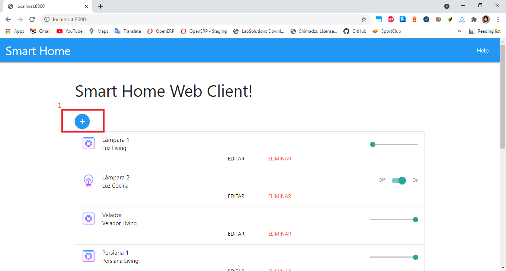
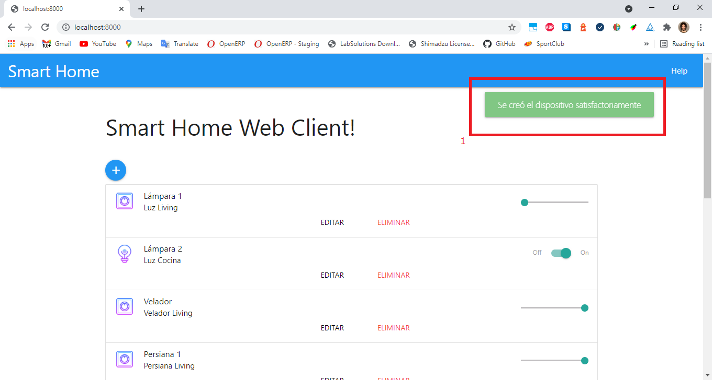
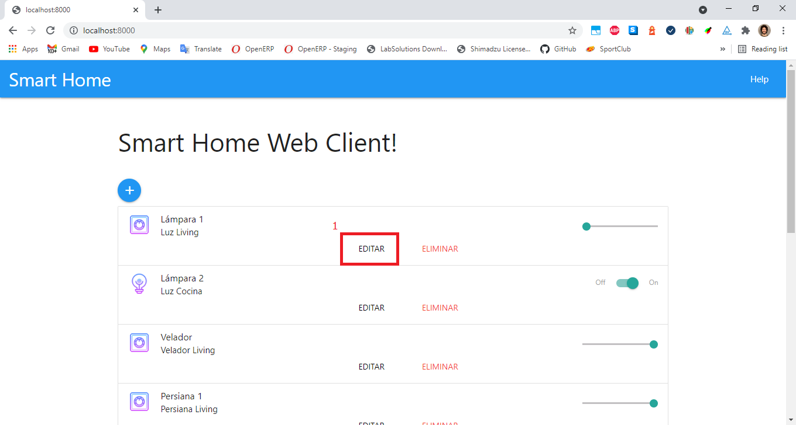
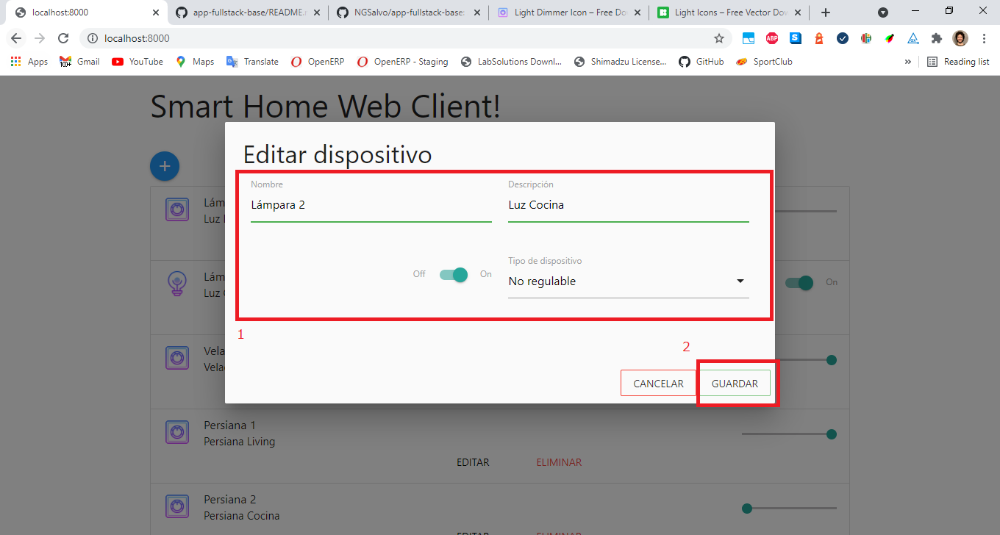
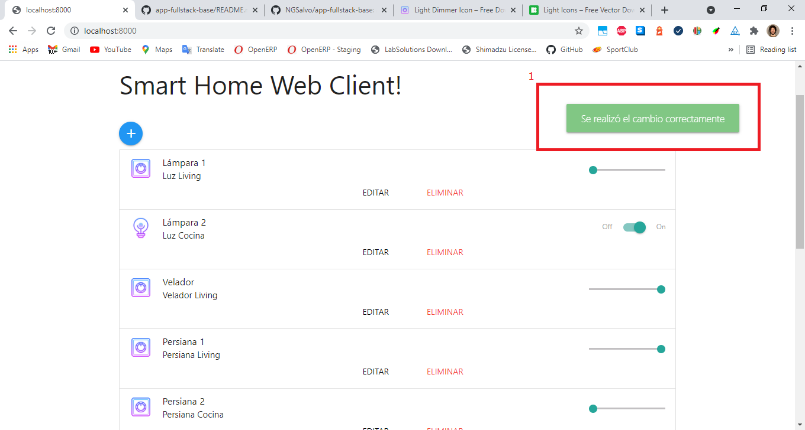
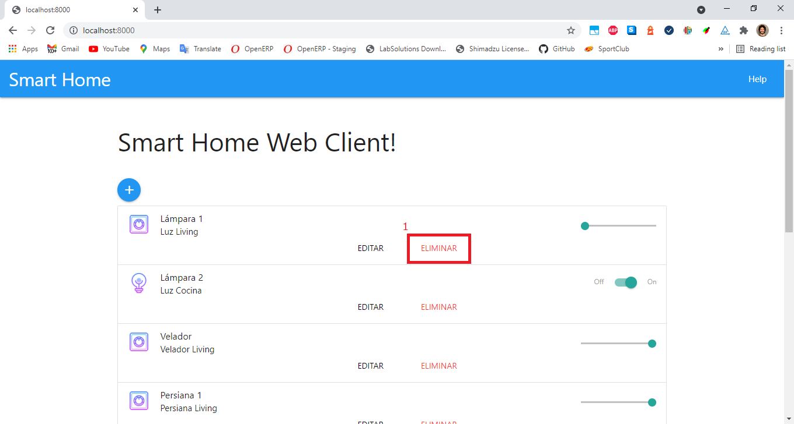
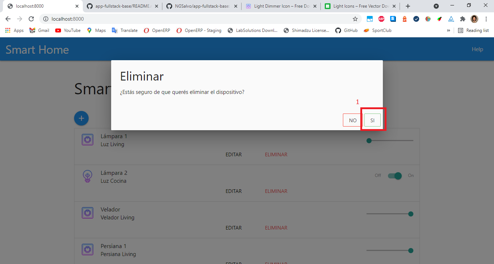
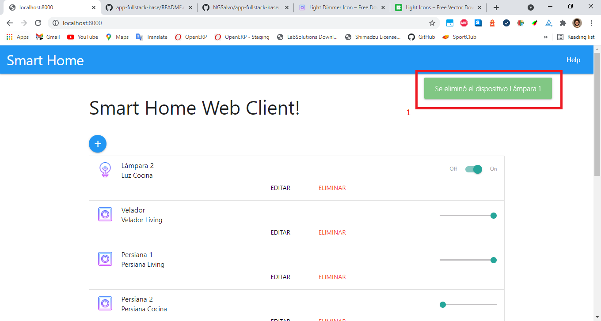

<a href="https://www.gotoiot.com/">
    
</a>

# Web App Full Stack Base

Este proyecto es una aplicación web fullstack que se ejecuta sobre el ecosistema `Docker`. Está compuesta por un compilador de `TypeScript` que te permite utilizar este superset de JavaScript para poder programar un `cliente web`. También tiene un servicio en `NodeJS` que te permite ejecutar código en backend y al mismo tiempo disponibilizar el código del cliente web para interactar con el servicio.

La aplicación IoT de base que viene con este proyecto se encarga de crear una tabla llamada `Devices` en la base de datos, y la idea es que vos puedas desarrollar el código de backend y frontend que te permita controlar desde el navegador el estado de los devices de un hogar inteligente - _como pueden ser luces, TVs, ventiladores, persianas, enchufes y otros_ - y almacenar los estados de cada uno en la base de datos.

En esta imagen podés ver una posible implementación del cliente web que controla los artefactos del hogar.


## Comenzando 🚀

Esta sección es una guía con los pasos escenciales para que puedas poner en marcha la aplicación.

<details><summary><b>Mira los pasos necesarios</b></summary><br>

### Instalar las dependencias

Para correr este proyecto es necesario que instales `Docker` y `Docker Compose`.

En [este artículo](https://www.gotoiot.com/pages/articles/docker_installation_linux/) publicado en la web están los detalles para instalar Docker y Docker Compose en una máquina Linux.

En caso que quieras instalar las herramientas en otra plataforma o tengas algún incoveniente, podes leer la documentación oficial de [Docker](https://docs.docker.com/get-docker/) y también la de [Docker Compose](https://docs.docker.com/compose/install/).

Continua con la descarga del código cuando tengas las dependencias instaladas y funcionando.

### Descargar el código

Para descargar el código, utiliza este comando desde la terminal o con tu IDE favorito.

```
git clone https://github.com/NGSalvo/app-fullstack-base.git
```

> No es necesario contar con una cuenta en Github.

### Ejecutar la aplicación

Para ejecutar la aplicación tenes que correr el comando `docker-compose up` desde la raíz del proyecto. Este comando va a descargar las imágenes de Docker de node, de typescript, de la base datos y del admin de la DB, y luego ponerlas en funcionamiento.

Para acceder al cliente web ingresa a a la URL [http://localhost:8000/](http://localhost:8000/).

Si pudiste acceder al cliente web significa que la aplicación se encuentra corriendo bien.

> Si te aparece un error la primera vez que corres la app, detené el proceso y volvé a iniciarla. Esto es debido a que el backend espera que la DB esté creada al iniciar, y en la primera ejecución puede no alcanzar a crearse. A partir de la segunda vez el problema queda solucionado.

</details>

Continuá explorando el proyecto una vez que lo tengas funcionando.

## Configuraciones de funcionamiento 🔩

Al crearse la aplicación se ejecutan los contenedores de Docker de cada servicio, se crea la base de datos y sus tablas. A continuación podés encontrar info si querés cambiar la estructura de la DB o bien sus configuraciones de acceso.

## Detalles principales 🔍

En esta sección vas a encontrar las características más relevantes del proyecto.

<details><summary><b>Mira los detalles más importantes de la aplicación</b></summary><br>
<br>

### Arquitectura de la aplicación

Como ya pudiste ver, la aplicación se ejecuta sobre el ecosistema Docker, y en esta imagen podés ver el diagrama de arquitectura.


### El cliente web

El cliente web es una Single Page Application que se comunica con el servicio en NodeJS mediante JSON a través de requests HTTP. Puede consultar el estado de dispositivos en la base de datos (por medio del servicio en NodeJS) y también cambiar el estado de los mismos. Los estilos del código están basados en [**Material Design**](https://materializecss.com/).

### El servicio web

El servicio en **NodeJS** posee distintos endpoints para comunicarse con el cliente web mediante requests HTTP enviando **JSON** en cada transacción. Procesando estos requests es capaz de comunicarse con la base de datos para consultar y controlar el estado de los dispositivos, y devolverle una respuesta al cliente web también en formato JSON. Así mismo el servicio es capaz de servir el código del cliente web.

### El compilador de TypeScript

**TypeScript** es un lenguaje de programación libre y de código abierto desarrollado y mantenido por Microsoft. Es un superconjunto de JavaScript, que esencialmente añade tipos estáticos y objetos basados en clases. Para esta aplicación se usa un compilador de TypeScript basado en una imagen de [Harmish](https://hub.docker.com/r/harmish) en Dockerhub, y está configurado para monitorear en tiempo real los cambios que se realizan sobre el directorio **src/frontend/ts** y automáticamente generar código compilado a JavaScript en el directorio **src/frontend/js**. Los mensajes del compilador aparecen automáticamente en la terminal al ejecutar el comando **docker-compose up**.

### Ejecución de servicios

Los servicios de la aplicación se ejecutan sobre **contenedores de Docker**, así se pueden desplegar de igual manera en diferentes plataformas. Los detalles sobre cómo funcionan los servicios los podés ver directamente en el archivo **docker-compose.yml**.

### Organización del proyecto

En la siguiente ilustración podés ver cómo está organizado el proyecto para que tengas en claro qué cosas hay en cada lugar.

```sh
├── db                          # directorio de la DB
│   ├── data                    # estructura y datos de la DB
│   └── dumps                   # directorio de estructuras de la DB
│       └── smart_home.sql      # estructura con la base de datos "smart_home"
├── doc                         # documentacion general del proyecto
└── src                         # directorio codigo fuente
│   ├── backend                 # directorio para el backend de la aplicacion
│   │   ├── index.js            # codigo principal del backend
│   │   ├── mysql-connector.js  # codigo de conexion a la base de datos
│   │   ├── package.json        # configuracion de proyecto NodeJS
│   │   └── package-lock.json   # configuracion de proyecto NodeJS
│   └── frontend                # directorio para el frontend de la aplicacion
│       ├── js                  # codigo javascript que se compila automáticamente
│       ├── static              # donde alojan archivos de estilos, imagenes, fuentes, etc.
│       ├── ts                  # donde se encuentra el codigo TypeScript a desarrollar
│       └── index.html          # archivo principal del cliente HTML
├── docker-compose.yml          # archivo donde se aloja la configuracion completa
├── README.md                   # este archivo
├── CHANGELOG.md                # archivo para guardar los cambios del proyecto
├── LICENSE.md                  # licencia del proyecto
```

</details>

## Detalles de implementación 💻

En esta sección podés ver los detalles específicos de funcionamiento del código y que son los siguientes.

<details><summary><b>Mira los detalles de implementación</b></summary><br>

### Agregar un dispositivo

Para agregar un dispositvo se debe presionar sobre el botón que se muestra en la **Figura 1**.



<figcaption><p align=center>Figura 1.</p></figcaption>

Llenar los datos y presionar el botón **Guardar** como se muestra en la **Figura 2**.


<figcaption><p align=center>Figura 2.</p></figcaption>

Una vez guardado debe desplegarse la notificación de guardado exitoso. Ver **Figura 3**.



<figcaption><p align=center>Figura 3.</p></figcaption>

### Editar un dispositivo

Para editar, presionar sobre el botón **Editar** en uno de los dispositivos como se muestra en la **Figura 4**.



<figcaption><p align=center>Figura 4.</p></figcaption>

Cuando se abre el modal, traerá los datos del dispositivo seleccionado. Editar los campos que se deseen y presionár el botón **Guardar** como se muestra en la **Figura 5**.



<figcaption><p align=center>Figura 5.</p></figcaption>

Una vez guardado debe desplegarse la notificación de cambio exitoso. Ver **Figura 6**.



<figcaption><p align=center>Figura 6.</p></figcaption>

### Eliminar un dispositivo

Para eliminar un dispositivo, presionar sobre el botón **Eliminar** en uno de los dispositivos como se muestra en la **Figura 7**.



<figcaption><p align=center>Figura 7.</p></figcaption>

En el modal, presionar sobre el botón **Sí** para confirmar la eliminación como se muestra en la **Figura 8**.



<figcaption><p align=center>Figura 8.</p></figcaption>

Una vez confirmado debe desplegarse la notificación de eliminación exitosa. Ver **Figura 9**.



<figcaption><p align=center>Figura 9.</p></figcaption>

### Frontend

El frontend está divido en 3 grandes clases:

- main.ts
- MyFramework.ts
- ViewMainPage.ts

`main.ts` está compuesto por la logica principal del programa. En ella se encuentran el manejo de eventos de la UI.

`MyFramework.ts` contiene algunas utilidades para obtención de partes del DOM. También posee la estructura principal de los llamados AJAX.

`ViewMainPage.ts` contiene solo modificaciones del DOM, como los agregados de los dispositivos. También cuenta con la función de renderización y refresco de los dispositivos.

Interactua con el backend por medio de las llamadas AJAX, realizando las correspondientes peticions GET (para obtener información del servidor), PUT (para actualizar un dispositivo), POST (para agregar un dispositivo) y DELETE (para eliminación de un dispositivo).

### Backend

El backend consiste de todos los endpoints para que el cliente web interactue. Estos endpoints contienen la lógica para escribir y obtener información de un archivo `devices.json`.

Los métodos utilizados son GET, POST, PUT y DELETE.

GET obtiene información.
POST agrega nueva información.
PUT modifica información.
DELETE elimina información.

Para fines demostrativos se utilizaron los 4 tipos, pero dado que el proyecto fue realizado con archivos, hubiese alcanzado simplemente con POST y GET.

<details><summary><b>Ver los endpoints disponibles</b></summary><br>

## Obtener todos los dispositivos

```json
{
  "endpoint": "/devices",
  "method": "get",
  "request_headers": "application/json",
  "request_body": "",
  "response_code": 200,
  "response_body": {
    "devices": [
      {
        "id": 1,
        "name": "Lámpara 1",
        "description": "Luz Living",
        "state": 0,
        "type": 0
      }
    ]
  }
}
```

## Obtener un dispositivo

```json
{
  "endpoint": "/devices/:id",
  "method": "get",
  "request_headers": "application/json",
  "request_body": "",
  "response_code": 200,
  "response_body": {
    "devices": {
      "id": 1,
      "name": "Lámpara 1",
      "description": "Luz Living",
      "state": 0,
      "type": 0
    }
  }
}
```

## Actualizar un dispositivo

```json
{
  "endpoint": "/devices/:id",
  "method": "put",
  "request_headers": "application/json",
  "request_body": "Cualquier parámetro de un dispositivo",
  "response_code": 200,
  "response_body": { "message": "Se realizó el cambio correctamente" }
  }
}
```

## Crear un dispositivo

```json
{
  "endpoint": "/devices/create",
  "method": "post",
  "request_headers": "application/json",
  "request_body": "",
  "response_code": 201,
  "response_body": {
    "devices": { "message": "Se creó el dispositivo satisfactoriamente" }
  }
}
```

## Eliminar un dispositivo

```json
{
  "endpoint": "/devices/:id",
  "method": "delete",
  "request_headers": "application/json",
  "request_body": "Cualquier parámetro de un dispositivo",
  "response_code": 200,
  "response_body": { "message": "Se eliminó el dispositivo Lámpara 1" }
  }
}
```

</details>

</details>

## Tecnologías utilizadas 🛠️

En esta sección podés ver las tecnologías más importantes utilizadas.

<details><summary><b>Mira la lista completa de tecnologías</b></summary><br>

- [Docker](https://www.docker.com/) - Ecosistema que permite la ejecución de contenedores de software.
- [Docker Compose](https://docs.docker.com/compose/) - Herramienta que permite administrar múltiples contenedores de Docker.
- [Node JS](https://nodejs.org/es/) - Motor de ejecución de código JavaScript en backend.
- [Material Design](https://material.io/design) - Bibliotecas de estilo responsive para aplicaciones web.
- [TypeScript](https://www.typescriptlang.org/) - Superset de JavaScript tipado y con clases.

</details>

## Sobre Goto IoT 📖

Goto IoT es una plataforma que publica material y proyectos de código abierto bien documentados junto a una comunidad libre que colabora y promueve el conocimiento sobre IoT entre sus miembros. Acá podés ver los links más importantes:

- **[Sitio web](https://www.gotoiot.com/):** Donde se publican los artículos y proyectos sobre IoT.
- **[Github de Goto IoT:](https://github.com/gotoiot)** Donde están alojados los proyectos para descargar y utilizar.
- **[Comunidad de Goto IoT:](https://groups.google.com/g/gotoiot)** Donde los miembros de la comunidad intercambian información e ideas, realizan consultas, solucionan problemas y comparten novedades.
- **[Twitter de Goto IoT:](https://twitter.com/gotoiot)** Donde se publican las novedades del sitio y temas relacionados con IoT.
- **[Wiki de Goto IoT:](https://github.com/gotoiot/doc/wiki)** Donde hay información de desarrollo complementaria para ampliar el contexto.

## Autores 👥

Las colaboraciones principales fueron realizadas por:

- **[Agustin Bassi](https://github.com/agustinBassi)**: Ideación, puesta en marcha y mantenimiento del proyecto.
- **[Ernesto Giggliotti](https://github.com/ernesto-g)**: Creación inicial del frontend, elección de Material Design.
- **[Brian Ducca](https://github.com/brianducca)**: Ayuda para conectar el backend a la base de datos, puesta a punto de imagen de Docker.
- **[Nicolás Salvo](https://github.com/NGSalvo)**: realizó el ejercicio para la materia DAW de la Carrera de Especialización en Internet de las Cosas.

También podés mirar todas las personas que han participado en la [lista completa de contribuyentes](https://github.com/###/contributors).

## Licencia 📄

Este proyecto está bajo Licencia ([MIT](https://choosealicense.com/licenses/mit/)). Podés ver el archivo [LICENSE.md](LICENSE.md) para más detalles sobre el uso de este material.

---

**Copyright © Goto IoT 2021** ⌨️ [**Website**](https://www.gotoiot.com) ⌨️ [**Group**](https://groups.google.com/g/gotoiot) ⌨️ [**Github**](https://www.github.com/gotoiot) ⌨️ [**Twitter**](https://www.twitter.com/gotoiot) ⌨️ [**Wiki**](https://github.com/gotoiot/doc/wiki)
